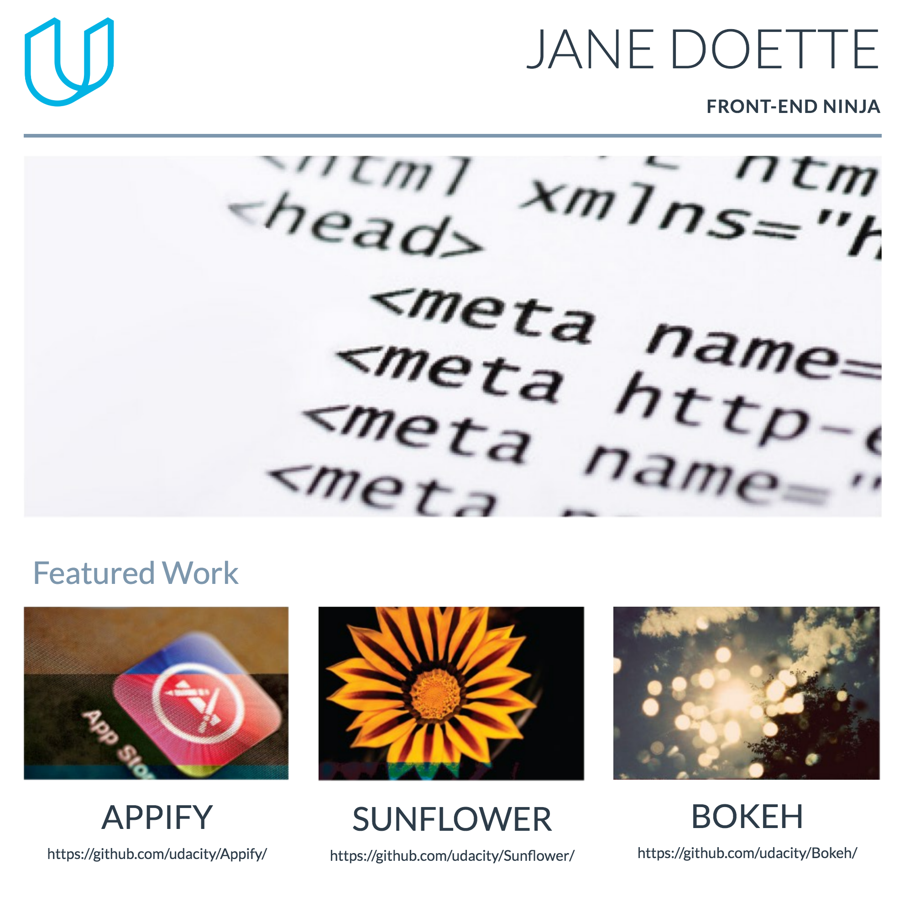

# 

A simple, elegant and beautiful portfolio website built using Bootstrap 3 and jQuery 2

## Install

```
$ git clone https://github.com/thecrazybob/portfolio.git
```

## Usage

#### Changing the title
```
<div id="title" class="col-md-6">
	<h1>Title Here</h1><br>
	<h2>Tagline Here</h2>
</div>
```

#### Adding a new portfolio item
```
<div class="col-md-4">
	
	<h3>Bokeh</h3>
	<p>
		<a href="https://github.com/udacity/Bokeh/" target="_blank">
			https://github.com/udacity/Bokeh/
		</a>
	</p>
</div>
```
